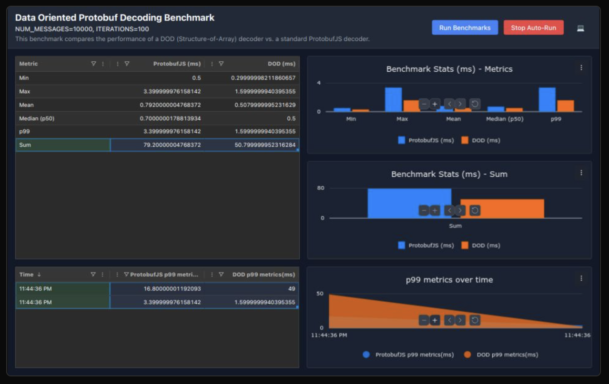

# ProtoDoDBench

A modern web application for benchmarking and comparing performance between Protocol Buffers (protobuf) and Data-Oriented Design (DOD) implementations. Built with React, TypeScript, and Vite.

## Features

- Real-time performance benchmarking between protobuf and DOD implementations
- Interactive data visualization using AG Grid Enterprise
- Historical performance tracking with p99 metrics
- Dark/Light theme support
- Auto-run capability for continuous benchmarking
- Comprehensive performance metrics including:
  - Minimum execution time
  - Maximum execution time
  - Mean execution time
  - Median (p50) execution time
  - p99 execution time
  - Total execution time

## Screenshots

### Main Dashboard


### Performance Metrics


### Historical Data


## TODO

### Benchmark Scenarios
The application will be extended to compare the following scenarios:

1. **Large Number Fields Model**
   - 100 numeric fields (integers, floats, doubles)
   - Comparison of serialization/deserialization performance
   - Memory usage analysis

2. **Large String Fields Model**
   - 100 string fields
   - Various string lengths and patterns
   - UTF-8 encoding performance

3. **Nested Fields Model**
   - Complex nested structures
   - Multiple levels of nesting
   - Array fields within nested objects
   - Performance impact of different nesting depths

### Future Enhancements
- [ ] Add support for different protobuf field types
- [ ] Implement memory usage tracking
- [ ] Add export functionality for benchmark results
- [ ] Support for custom benchmark scenarios
- [ ] Real-time performance graphs
- [ ] Comparison with other serialization formats

## Tech Stack

- React 19
- TypeScript
- Vite
- AG Grid Enterprise
- Protocol Buffers (protobufjs)
- PBF (Protocol Buffer Format)
- Bun (JavaScript runtime & package manager)
- Modern development tools (ESLint, Prettier, Husky)

## Getting Started

### Prerequisites

- [Bun](https://bun.sh) (latest version recommended)
- Node.js (latest LTS version recommended) - for development tools

### Installation

1. Clone the repository:
```bash
git clone https://github.com/yourusername/protododbench.git
cd protododbench
```

2. Install dependencies:
```bash
bun install
```

3. Generate Protocol Buffer files:
```bash
bun run generate:proto
```

4. Start the development server:
```bash
bun run dev
```

### Available Scripts

- `bun run dev` - Start development server
- `bun run build` - Build for production
- `bun run preview` - Preview production build
- `bun run generate:proto` - Generate Protocol Buffer files
- `bun run lint` - Run ESLint
- `bun run format` - Format code with Prettier

## Project Structure

```
src/
├── components/     # React components
├── hooks/         # Custom React hooks
├── types/         # TypeScript type definitions
├── MyModel.proto  # Protocol Buffer definition
└── App.tsx        # Main application component
```

## Benchmarking Model

The benchmark compares two approaches for handling the following data structure:

```protobuf
message MyModel {
  fixed32 id = 1;
  double value = 2;
}
```

- **Protocol Buffers**: Using protobufjs for serialization/deserialization
- **Data-Oriented Design**: Using a custom implementation optimized for performance

## Contributing

1. Fork the repository
2. Create your feature branch (`git checkout -b feature/amazing-feature`)
3. Commit your changes (`git commit -m 'Add some amazing feature'`)
4. Push to the branch (`git push origin feature/amazing-feature`)
5. Open a Pull Request

## License

This project is licensed under the MIT License - see the LICENSE file for details.
